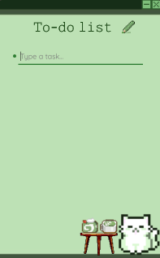

## **✨ Cute To-Do List**
A simple, cute, and interactive to-do list app to keep your tasks organized! Perfect for jotting down quick notes and crossing off completed tasks with a satisfying click. 🌱

## **🚀 Features**
✔ Add tasks easily – Just type and press Enter to create a new line! ✏️
✔ Mark tasks as done – Click on a task to cross it out! ✅ ~~(like this!)~~
✔ Select tasks – Click the button on the left to highlight a task. 🔍
✔ Delete tasks – Select a line, clear its text, then double-click Backspace to remove it. 🗑️

## **🛠️ Installation**
Make sure you have Node.js installed! (If not, download it first!)
1. Clone or download this repository.
2. Open the project folder in your terminal.
3. Run the app (instructions may vary based on your setup).
(if needed, use the command *npm install* in the terminal)
4. Finally, use the command *npm run build*

## **📝 How to Use**
1. Type a task and press *Enter* to add more.
2. Click a task to cross it out when done.
3. Click on the button, on the left of the line to select a task.
4. Delete a task? Select it, erase its text, then double-tap *Backspace*!